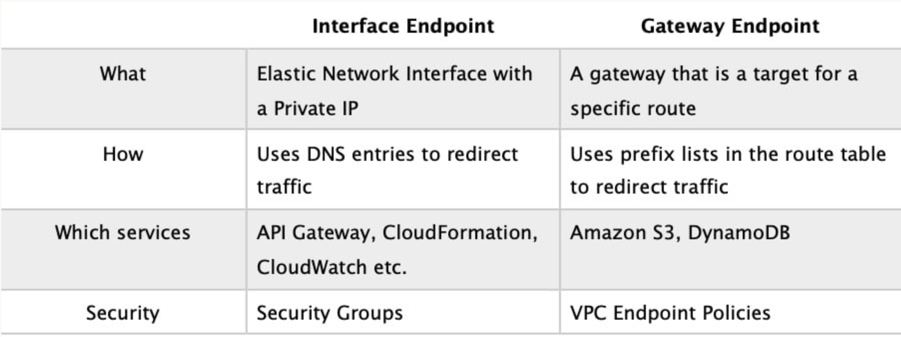

# AWS SAA cheatsheet

## Storage

### EFS

- Chỉ dùng ở máy chủ linux
- File locking + concurrent access + **auto scaling** = EFS

### EBS

- to keep the attached EBS volumes when I terminate an instance = Use DeleteOnTermination
- Proprietary File System = EBS
- SAN disc = EBS

### S3

- S3 không thể được bỏ vào VPC vì nó là PaaS được quản lý bởi AWS
- Là object-based storage system duy nhất
- S3 static web không support https
- Native trên các hệ FSx
- Dùng pre-signed URL để upload file trực tiếp lên S3
- Nếu so sánh cost giữa S3 và EBS thì S3 rẻ hơn
- Concurrent access to all files
- S3 Standard Infrequent Access: phục hồi data trong 1h
- S3 Glacier standard: phục hồi data trong 3-5h
- S3 Glacier Expedited retrieval: phục hồi data trong 10p
- DEEP_ARCHIVE has a minimum storage duration of 180 days
- Use CloudFront Signed Cookies restrict access to multiple files
- Use CloudFront Signed URL restrict access to a Single file
- Use Athena for querying the data and writing the results back to the bucket
- Không có indexing
- Có thể phân quyền cho user vào được thư mục chỉ định trên S3 nhờ vào IAM
- Amazon S3 Transfer Acceleration chỉ dùng để tăng tốc upload thôi
- Có thể send event đến sqs
- Due to S3 is eventually Consistent , reading after writing may return old data
- S3 Select is used to query data in S3 using SQL to retrieve subset of the data using server side filtering .
- to prevent deleting an object in S3 for a fixed amount of time = Use S3 Object lock
- Object Store + Immutable = Amazon Glacier
- Minimum Days for Transition from S3 Standard or S3 Standard-IA to S3 Standard-IA or S3 One Zone-IA is 30 days

### Encryption KEY

- Amazon S3-Managed Keys (**SSE-S3**) là AWS sẽ tự tạo key và quản lý key luôn
- **SSE-KMS** is similar to SSE-S3 but comes with some additional benefits over SSE-S3. Unlike SSE-S3 you can create and manage encryption keys yourself or you can use a default CMK key that is unique to you for the service that is being used (S3 in this case) and the region you are working in

### DynamoDB

- Luôn nằm ngoài VPC
- data in chunks + little latency
- backup DynamoDB + without affecting the application performance= Use On-demand backup
- DynamoDB stream lưu lại thông tin thay đổi của từng item trong 24h
- provisioned capacity mode does not automatically scale
- Các bước để migrate data từ premise lên aws dynamodb: dùng Schema Conversion Tool (AWS SCT) để extract data và lưu vào snowball Edge ⇒ sau đó data được load vào S3 ⇒ dùng AWS DMS để migrate data từ s3 vào dynamoDB
- to prevent read old “Stale” data = use strongly consistent reads
- master keys and unencrypted data should never be sent to AWS = client-side encryption with a client-side master key
- Không có read replica
- Muốn có latency dưới 100ms thì phải dùng Dynamo

DynamoDB best practices include:

> – Keep item sizes small.
> 

> – If you are storing serial data in DynamoDB that will require actions based on data/time use separate tables for days, weeks, months.
> 

> – Store more frequently and less frequently accessed data in separate tables.
> 

> – If possible compress larger attribute values.
> 

> – Store objects larger than 400KB in S3 and use pointers (S3 Object ID) in DynamoDB.
> 

### Storage gateway

- Volume Gateway with cached mode is the best option to migrage iSCSI to Cloud
- Không thể dùng Storage Gateway Volume Gateway in cached volume mode để lưu file từ NFS và SMB vì cached volume mode là block-based chứ ko phải file-based
- NFS supported by Storage Gateway File Gateway
- File Gateway uses the NFS or SMB protocols. Look for the word 'file' in an exam question.
- Stored Volumes store all data both on-premises and in the cloud. Data is backed up largely for Disaster Recovery (DR) if on-premises storage is no longer available for some reason. All data is kept on-premises
- Cached Volumes store all data in the cloud. Only frequently accessed data is kept on-premises
- If a company wants to minimize on-premises storage costs by storing only frequently accessed data while keeping everything else in the cloud, that's Cached Volumes.

### Snowball

## RDS

- Khi tạo DB mà không bật encrypted thì lúc tạo snapshot cũng không encrypted.
- You cannot scale write capacity by enabling Multi-AZ as only one DB is active and can be written to
- Chỉ scale được read theo chiều ngang và write theo chiều dọc
- Patching system sẽ khiến DB ngưng hoạt động
- Starting today, Amazon RDS support RDS Storage Auto Scaling. RDS Storage Auto Scaling automatically scales storage capacity in response to growing database workloads, with zero downtime.
- Chỉ có multi-AZ mới thực hiện failover được. Read replica không làm được, ngoại trừ Aurora

### ElastiCache

- ElastiCache is not used to create read replicas of RDS database
- Support multi-thread

### ElastiCache Redis

- No support multi-thread
- High-Availability (replication)
- Complex data types
- Vẫn thuộc dạng persistant
- Nên lưu session vào memory

### Aurora

- Có Multi-Master
- Support mySQL và Postgres
- Có thể có nhiều master DB
- Nếu câu hỏi là làm sao để backup data qua region khác thì chọn replica thay vì multi-AZ
- Chỉ hỗ trợ read cross region chứ ko hỗ trợ write đồng bộ cross region
- Transactional + High performance + Data size range 16 TB to 64 TB = Amazon Aurora
- by default, Aurora will replicated in at least three Availability zones.

## Data Analyzing

### Athena

- Combine RedShift Spectrum for the complex queries and Athena for the ad hoc SQL querying

### Kinesis Firehose

- Firehose Destinations include: Amazon S3, Amazon Redshift, Amazon Elasticsearch Service, and Splunk

### Redshift

- Using Amazon Redshift Spectrum, you can efficiently query and retrieve structured and semistructured data from files in Amazon S3 without having to load the data into Amazon Redshift tables
- Chỉ có snapshot chứ không có multi-AZ

### EMR

- Keyword liên quan: hadoop cluster

### QuickSight

- Dùng để visualize data
- Thường kết hợp với athena hoặc redshift

### Glue

- Dùng để transform data từ nhiều source về 1 destination khác
- Crawl data từ database

## Network

### Customer Gateway + VPG

- Cloudhub nghĩa là kết nối các on-premise lại với nhau

### Direct Connect

- Chỉ dùng cho on-premise
- **T**ăng bảo mật, tốc độ cho DR và tránh được đường truyền internet

### PrivateLink

- “allow the application to access service endpoints in the same region” = Use AWS PrivateLink
- có thể dùng privateLink để kết nối 2 VPC, VPC service sẽ tạo endpoint, VPC consumer sẽ dùng interface VPC endpoint để kết nối

### NAT gateway

- Chỉ có **Egress-only internet gateway** mới có IPv6
- high availability + internet accessing without having public IP = multi AZ with NAT gateway in each one , and put ELB in front of web servers.

### VPC

- VPN Logs =VPC Flow Logs
- keyword “administrate VPCs” = Use AWS CloudFormation
- Dùng Athena để analyze flow log được lưu trên S3

### VPC Endpoint

- Interface Endpoint tốn phí, truy cập được hầu hết các service aws
- Interface Endpoint thường được xài khi truy cập từ on-premise vào các service của aws qua VPN hoặc Direct Connect
- Gateway Endpoint miễn phí, truy cập được mỗi S3 và Dynamo

## EC2

- Launch Configurations dùng cho ASG, còn Launch Templates dùng cho EC2
- Scheduled Reserved Instances: ví dụ như thuê 1 tháng, mỗi ngày run từ 6h tối đến 6h sáng
- Không bị tính tiền EC2 spot nếu như bị amazon terminate khi xài chưa được 1 tiếng
- The actions which can be configured in case Spot instance termination are hibernate, stop, or terminate
- At EC2 level we cannot use WAF because AWS WAF is used to control how an Amazon CloudFront distribution, an Amazon API Gateway API, or an Application Load Balancer responds to web requests.
- To attach elastic network interface (ENI) with running EC2 instance , you have to use Hot Attach

## ECS

- Amazon ECS-Optimized AMI troubleshoot: “You need to verify that the installed agent is running and that the IAM instance profile has the necessary permissions applied.”

## Auto Scaling Group

- Target tracking không cần phải tạo cloud watch alarm.
- You cannot modify an existing launch configuration

Default termination policy behavior:

> 1. Destroy instance ở vùng số lượng nhiều nhất
2. Destroy on-demand
3. Destroy instance dùng lauch config cũ nhất
4. Destroy instance sắp tới giờ thanh toán gần nhất
> 

## Load Balancer

- Application Load Balancer is cheaper than ELB Classic Load Balancer
- To distribute the traffic between both environments (premise vs aws) (Active – Active)= Use Use Route 53 weighted routing policy
- Elastic Load Balancing provides access logs that capture detailed information about requests sent to your load balancer
- Internet-Facing LB needs public subnet for each AZ (2 x 1 public subnet). Web and DB servers need to be on separate pvt subnets in 2 AZs for HA (2 x 2 pvt subnets)

## Route53

- Alias records có thể target được tới **CloudFront, Elastic BeanStalk environment**

## CloudWatch

- Dùng cloudwatch logs để track log của application và notification khi có lỗi
- CloudTrail for API calls monitoring,
- CloudWatch for alerts
- AWS CloudTrail to monitor, and retain account activity related to actions across AWS multi Regions
- Enable cloudtrail log encryption with a single KMS key
- Event được lưu trên cloudTrain 90 ngày, muốn lâu hơn xài thì S3 để lưu

## AWS Lambda

- Muốn dùng resource bên trong private VPC thì cần có security group ID và Subnet ID
- configure the TTL is the only way to control caching in Amazon API Gateway.
- Scalable + cost-effective + ServerLess = Amazon API Gateway with AWS Lambda Function
- RAM 128MB ~ 10GB

## SQS

- handle failed messages = Amazon SQS dead-letter queue

## Other Services

### AWS Batch

- to operate third-party commercial or open source batch processing solutions

AWS Guard Duty dùng để kiểm tra xem tài khoản có bị tấn công hay không

AWS Inspector dùng để quét ECS và EC2 xem có lỗi bảo mật không, package có cũ không

## Other Note

- AWS allow **penetration** for some resources without prior authorization
- providing **single sign-on** between on-premises directories and the AWS management console using AWS Secure Token Service (STS) and SAML
- No SwapUsage metric in CloudWatch. All memory metrics must be custom metrics
- SMB là protocol của server windows chứ ko phải linux
- improves the availability and performance of the application = Use AWS Global Accelerator
- High Performance Computing dùng card EFA (**Elastic Fabric Adapter)**
- Nên nhớ phân biệt DMS và DataSync. DMS dùng để migrateDB chứ ko phải migrate files
- Global Accelerator cung cấp 2 static IP
- AWS is responsible for protecting the infrastructure that runs all of the services offered in the AWS Cloud. This infrastructure is composed of the hardware, software, networking, and facilities that run AWS Cloud services.
- By default, AWS has a limit of 20 instances per region. This includes all instances set up on your AWS account.
- simplify inventory and compliance management across accounts and regions = **AWS Config**
- You can connect your corporate Microsoft Active Directory to AWS SSO so that your users can sign in to the user portal with their user names and passwords to access the AWS accounts and applications to which you have granted them access
- securely managed +short-lived connection credentials = Use AWSAuthenticationPlugin
- AWS Security Token Service(STS) that enables you to request temporary, limited privilege credentials for IAM Users or Federated Users
- Use CloudFormation with scripts to create many member accounts within an AWS Organization

## SAA-C03

AWS Amplify dùng để build FE

AppSync  dùng để develop GraphQL

AWS device farm dùng để test UI trên mọi device, mọi browser

AWS Compute Optimizer dùng để nhận recommend về EC2, EBS và Lambda

## ML

AWS Rekognition dùng để nhận diện khuôn mặt, object

AWS Transcribe dùng để chuyển đổi speech sang Text

AWS Translate dùng để dịch

AWS SageMaker dùng để deploy ML model

AWS Comprehend dùng để process NLP

AWS Lex là chatbot

AWS Polly dùng chuyển đổi Text sang speech