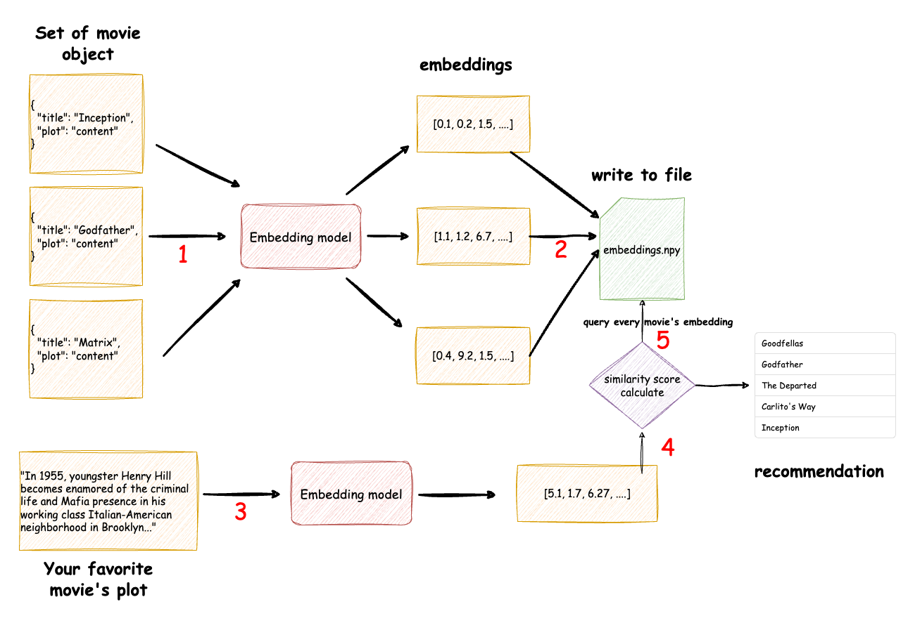
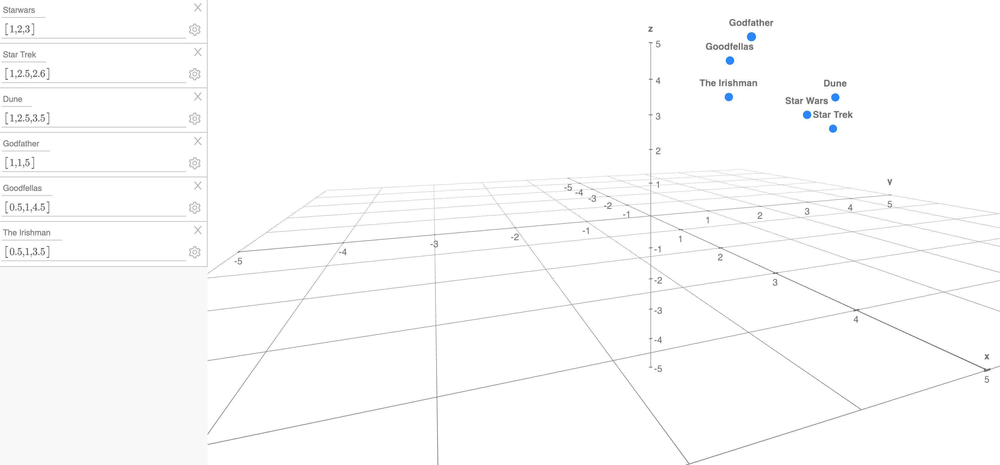
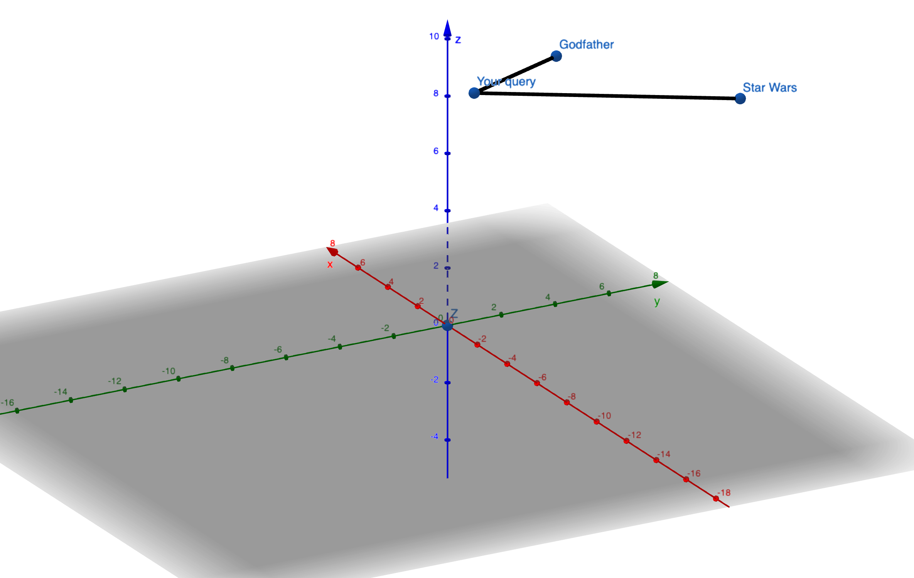
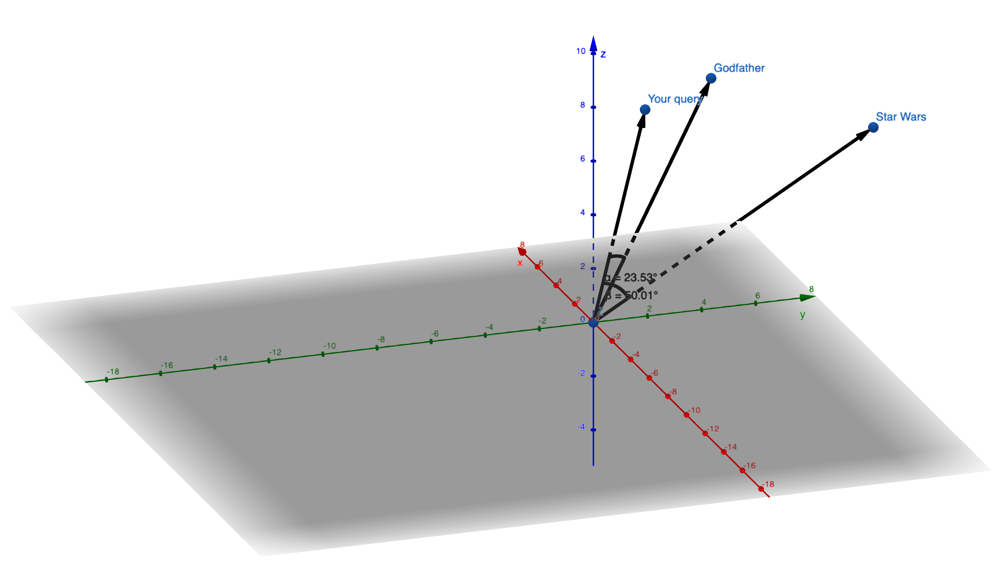
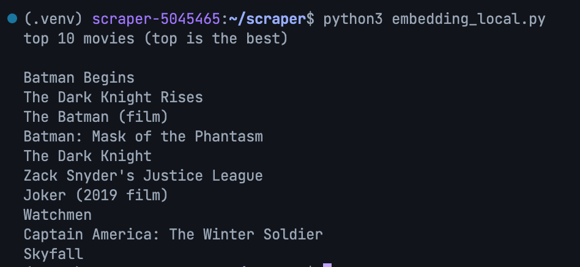
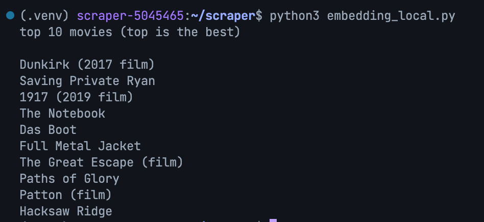
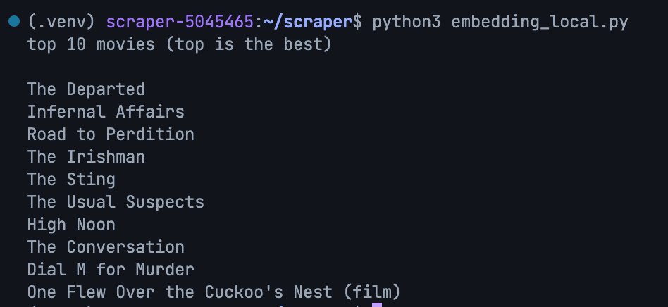
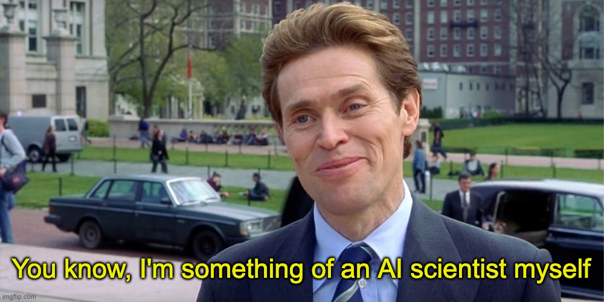

Need to find a movie by genre, actor, or director? IMDb has you covered. But what if you're looking for a movie with a similar plot or themes to one you loved? That's where **embedding similarity search** comes in!

## Introduction

I built this movie suggestion application because, like many of you, I was tired of endlessly scrolling through streaming services every movie night.  **Embedding similarity search** turned out to be the perfect solution for finding movies with genuinely similar plots.

In essence, **embedding similarity search** helps us unearth connections between items based on their deeper meaning, moving beyond simple keyword matching.

## How It Works



1. **Encode movie dataset into embeddings:** The process begins with a set of movie objects which stored in json file. Each movie plot is fed into an "Embedding model." This model converts the textual plot descriptions into numerical vector representations called "embeddings." These embeddings capture the semantic meaning of the plots.
2. **Store Embeddings:** For this simplified application, we'll store embeddings in a `.npy` file.  (You could use `.csv` or `.json`, but retrieving embeddings would require a bit more work).
3. **Encode Your Query:**  Think of your favorite movie's plot. We'll input this plot (you can easily grab it from Wikipedia), and it undergoes the same embedding process, generating its own numerical representation.
4. **Calculate Similarity Scores:** Your preferred plot embedding is compared to every movie embedding in our stored file.  A "similarity score" is calculated for each comparison, quantifying how semantically alike your chosen plot is to each movie in our dataset.
5. **Generate Recommendations:**  Finally, we get our movie suggestions! The application generates a ranked list based on the similarity scores. Movies with higher scores—indicating stronger semantic similarity to your input—appear higher on the recommendation list.

## Implementation

### Step 1: Gathering Movie Data

To get the most accurate similarity results, we need those plot summaries, and ideally with spoilers!  Wikipedia is our friend here.

Here's how I built a dataset of over 800 movies from IMDb's Top 1000:

1. **Scrape Metadata:** I extracted basic information (title, year, etc.) for the top 1000 movies from [IMDb](https://www.imdb.com/search/title/?groups=top_1000&count=250&sort=user_rating,desc).
2. **Fetch Plots from Wikipedia:** Using the movie titles, I used the Python [Wikipedia-API](https://pypi.org/project/Wikipedia-API/) library to retrieve full plot of the movie. And then saved all the gathered movie data into a `.json` file for easy access

#### You can get my movie data here ```https://huykanto.com/movieDataPlot.json``` or you can try to get the data yourself

```python title="movieDatasetScraper.py"
import wikipediaapi

wiki_wiki = wikipediaapi.Wikipedia('MyProjectName', 'en')
movieWiki = wiki_wiki.page('Inception')
print(movieWiki.section_by_title('Plot').text)

# In some cases, plots might be split across sections.
# You might need to combine and standardize this data:
# str(movieWiki.section_by_title('Plot')) 
```

### Step 2: **Encode movie dataset into embeddings and store it**

Let's talk about embeddings. Each movie plot is transformed into an embedding—a point in a multi-dimensional space. For simplicity, imagine a 3-dimensional embedding:



In reality, embedding models generate embeddings with hundreds or even thousands of dimensions.  We can't visualize that many dimensions, so it helps to keep the 3D analogy in mind.

For this project, I'm using the `all-mpnet-base-v2` model, which generates 768-dimensional embeddings. Feel free to experiment with other powerful models like OpenAI's or Google's Gemini. While syntax might differ, the core concepts remain the same.

Here's how embedding models work:

1. **Tokenization:** Break down the text into individual words or subwords.
2. **Word Embeddings:**  Look up pre-trained vectors representing the meaning of each token.
3. **Contextual Encoding:** Sophisticated architectures analyze the relationships and context between words in the sentence.
4. **Final Embedding:**  The model outputs a final embedding vector where both the direction and magnitude encode the meaning of the entire input text.

Now, let's generate embeddings for our movie plots:

```python title="embedding.py"
import json
from sentence_transformers import SentenceTransformer, util
model = SentenceTransformer('all-mpnet-base-v2') 

# Load movie data
with open('movieDataPlot.json') as f:
    movieData = json.load(f)

# Start embed
embeddings = []
for movie in movieData:
    text = f"{movie['title']} - {movie['plot']}"
    embedding = model.encode(text)
    embeddings.append(embedding)

# Using numpy to store embeddings
np.save("embeddings.npy", embeddings)
```

### Step 3: Embedding Your Movie Query

You can either pick a movie from your dataset or input your own plot summary.

```python title="embedding.py"
# Using a plot from the dataset
moviePlotforQuery = movieData[33]["plot"] 

# To input your own plot, replace the line above with:
# moviePlotforQuery = "Enter your favorite movie's plot here"

queryEmbedding = model.encode(moviePlotforQuery)
```

### Step 4: Calculating Semantic Similarity

Remember our embedding points in space? We need a way to compare our `queryEmbedding` to all other embeddings and find the closest matches.

Here are three common similarity measures:

1. **Euclidean Distance:**  Measures the straight-line distance between points.
   - **Common Usage:**  Well-suited for tasks like face recognition where pixel-level differences matter. Smaller distances mean a closer visual match.

   

2. **Dot Product:**  Calculates the dot product between two vectors.
   - **Common Usage:** Similar to cosine similarity, but the magnitude (length) of the vectors plays a significant role.

3. **Cosine Similarity:**  Measures the cosine of the angle between two vectors.
   - **Common Usage:**  Ideal when the magnitude of the embedding vectors is less important.  For instance, in text analysis, longer documents naturally have larger vectors, but cosine similarity normalizes for this.

   

For our movie recommendation system, **Cosine Similarity** is a great choice!

```python title="embedding.py"
'''
For each movie, calculate the cosine similarity between its embedding and 
your query embedding. Cosine similarity ranges from -1 (opposite) to 
1 (identical).
'''
similarities = []
for movie_embedding in embeddings:
  similarity = util.cos_sim(queryEmbedding, movie_embedding)  # Use cosine similarity 
  similarities.append(similarity.item())  # Extract single value from tensor

# Sort similarities based on similarity score and get top 10 similar movie index
top_indices = sorted(range(len(similarities)), key=lambda i: similarities[i], reverse=True)[:10]

# 4. Print the titles of the top 10 movies
for index in top_indices:
  # Assuming your 'movies' list and 'embeddings' list have the same order
  print(movieData[index]['title'])
```

## Full Source Code

Here's the complete code for your reference:

```python title="embedding.py"
import json
from sentence_transformers import SentenceTransformer, util
model = SentenceTransformer('all-mpnet-base-v2') 

# Load movie data
with open('movieDataPlot.json') as f:
    movieData = json.load(f)

# Start embed
embeddings = []
for movie in movieData:
    text = f"{movie['title']} - {movie['plot']}"
    embedding = model.encode(text)
    embeddings.append(embedding)

# using numpy to store embeddings
np.save("embeddings.npy", embeddings)

'''
For each movie, calculate the cosine similarity between its embedding and your  
movie embedding. Cosine similarity is a common measure of similarity between 
vectors, ranging from -1 (opposite) to 1 (identical).
'''
similarities = []
for movie_embedding in embeddings:
  similarity = util.cos_sim(queryEmbedding, movie_embedding)  # Use cosine similarity 
  similarities.append(similarity.item())  # Extract single value from tensor

# Sort similarities based on similarity score and get top 10 similar movie index
top_indices = sorted(range(len(similarities)), key=lambda i: similarities[i], reverse=True)[:10]

# 4. Print the titles of the top 10 movies
for index in top_indices:
  # Assuming your 'movies' list and 'embeddings' list have the same order
  print(movieData[index]['title'])
```

Very simple, isn’t it?

## Testing

Let's see our movie recommender in action!

**Query:** **Batman Begins**



**Query:** **Dunkirk**



**Query:** **The Departed**



 (It correctly identified *Infernal Affairs*, the Hong Kong film *The Departed* was based on!)

## Outro

Me after finish this article



Congratulations! You've just built a movie recommendation system powered by the magic of embeddings. This technique is fundamental to many exciting applications in AI, including **Retrieval Augmented Generation (RAG)**.

Embeddings allow computers to move beyond literal keyword matching and start to grasp the semantic meaning behind our words. This opens up a world of possibilities for building more intuitive and intelligent systems.

> *Finally, a computer that understands the difference between 'correlation' and 'causation'! ...Or at least it can convincingly pretend to with the right Wikipedia links.*
>